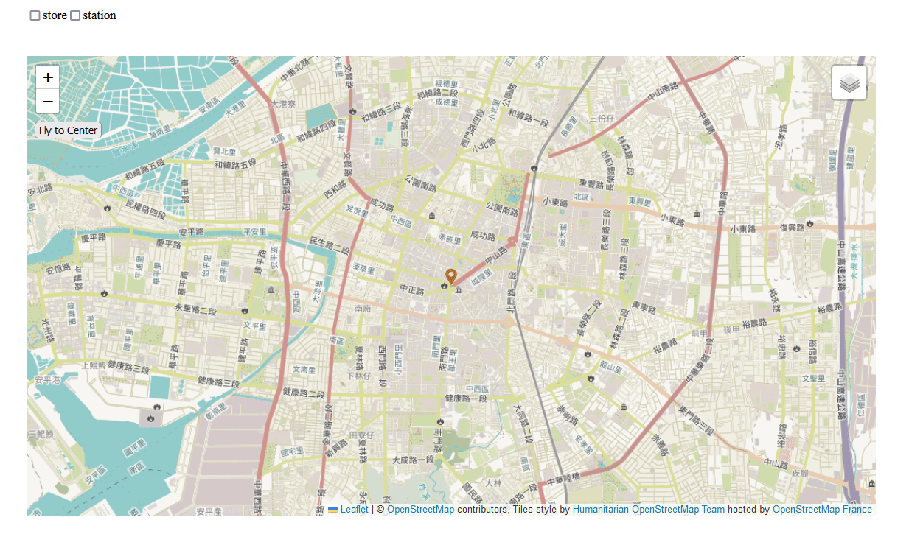

#  open-map_BY_react-leaflet

用 react 和 leaflet，呈現一個簡單的地圖 





## 功能

- 右上
  - 切換 Layer 
  - 顯示那些圖層 ( user / location )
- 左上
  - 顯示那些 Marker ( store / station )

## 使用

```
$ npm i
```

```
$ npm run dev
```

